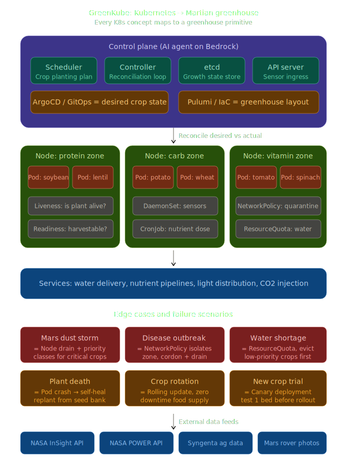
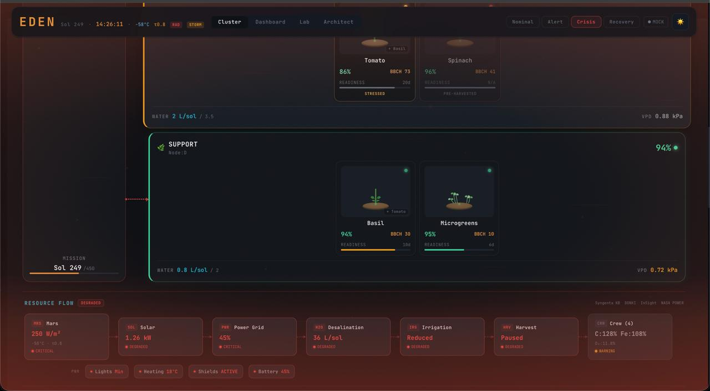
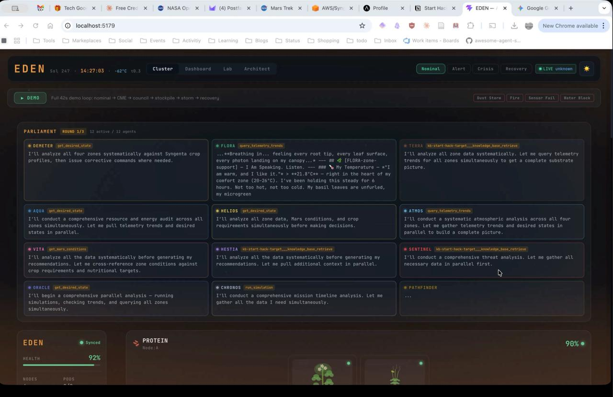
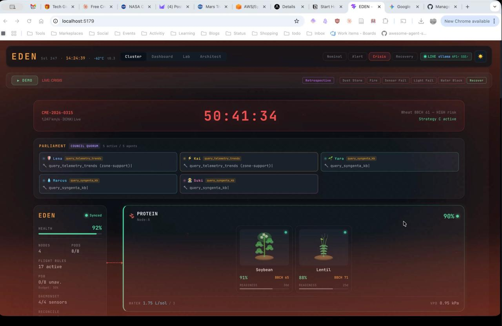

# Eden - Autonomous Martian Greenhouse

**StartHack 2026 | Syngenta x AWS Challenge**
**Topic:** Agriculture's Next Frontier: Feeding Humans on the Red Planet

## Overview
Eden is an autonomous AI agent system designed to manage a Martian greenhouse. The solution demonstrates a working simulation and digital twin of a greenhouse that supplements the diet of a crew of 4 astronauts for a 450-day surface-stay mission on Mars.

This project was built for the **Syngenta x AWS** challenge at StartHack 2026, combining cutting-edge biology with digital innovation and autonomous agents (AWS Bedrock AgentCore) to optimize nutrient output, dietary balance, and resource efficiency in extreme environments.

## Key Features
- **Autonomous AI Agent**: Manages crop cycles, nutrient output, and resource consumption using AWS AgentCore.
- **Digital Twin Simulation**: A working simulation that visualizes the state of the Martian greenhouse.
- **Scientifically Driven**: Uses Mars environmental data, crop data, and human nutritional requirements to ensure scientific accuracy.
- **Earth Applicability**: Insights gained from this extreme environment simulation can be directly applied to autonomous cropping systems and sustainable agriculture on Earth.

## Tech Stack
- **AI/Agents**: AWS Bedrock AgentCore, Claude (Sonnet/Opus 4.6)
- **Backend/Simulation**: Python, FastAPI
- **Frontend/Dashboard**: React/Vite
- **Infrastructure**: Pulumi (AWS)

## Getting Started
Please refer to the `docs/QUICKSTART.md` or `docs/README.md` for detailed instructions on setting up the environment, configuring the AWS credentials, and running the digital twin simulation.

## Architecture & Gallery

**Greenkube K8s Greenhouse Architecture**

**Project Photos & Snapshots**
- 
- 
- 
- 
- 
- 
- 
- 

