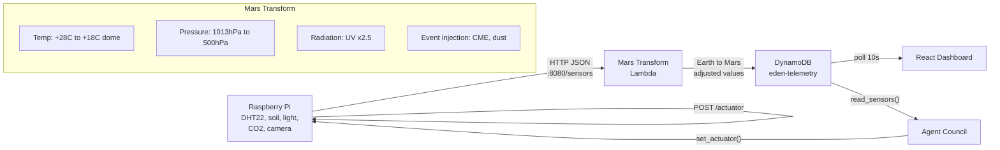
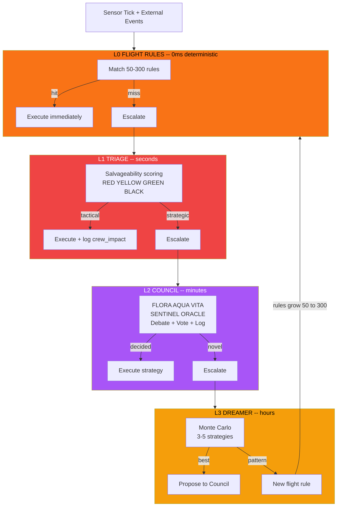
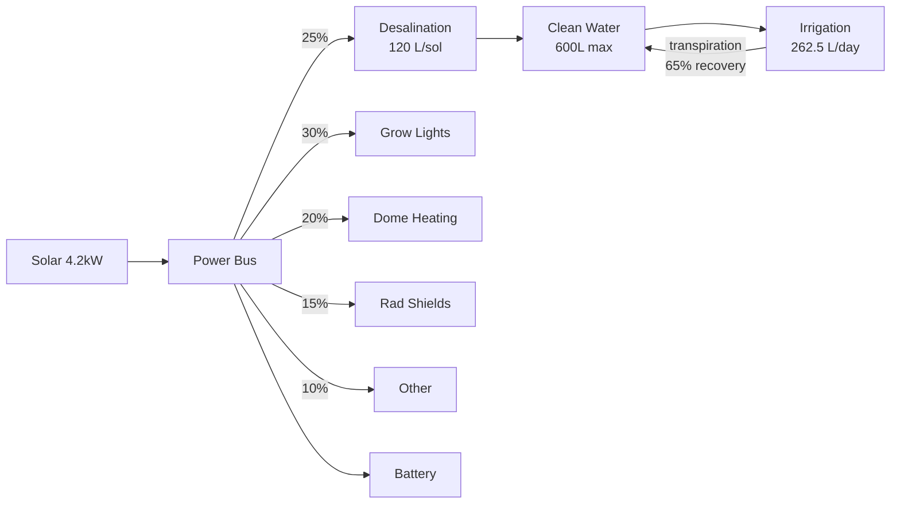
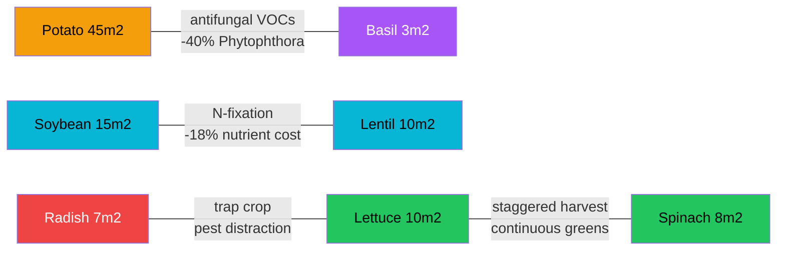
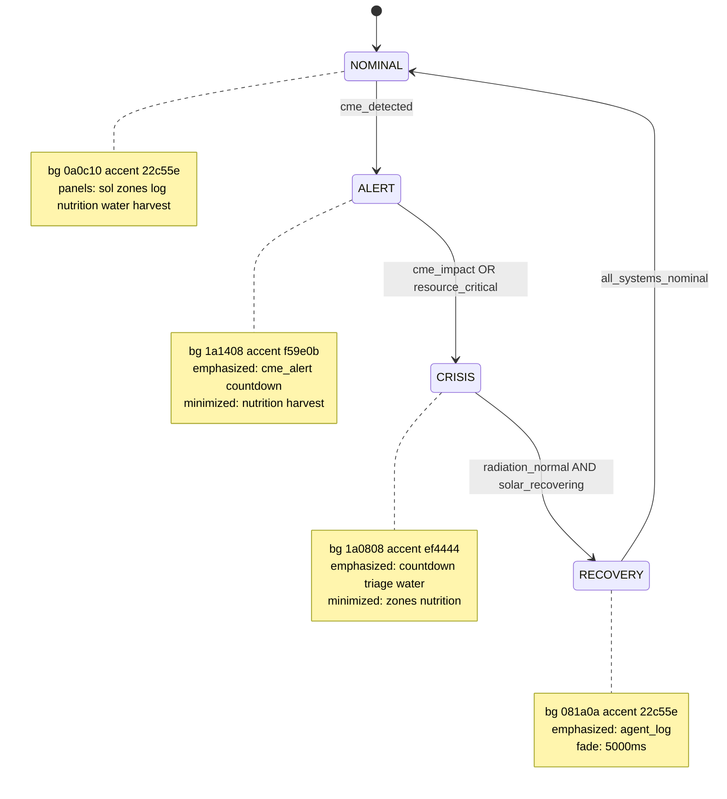
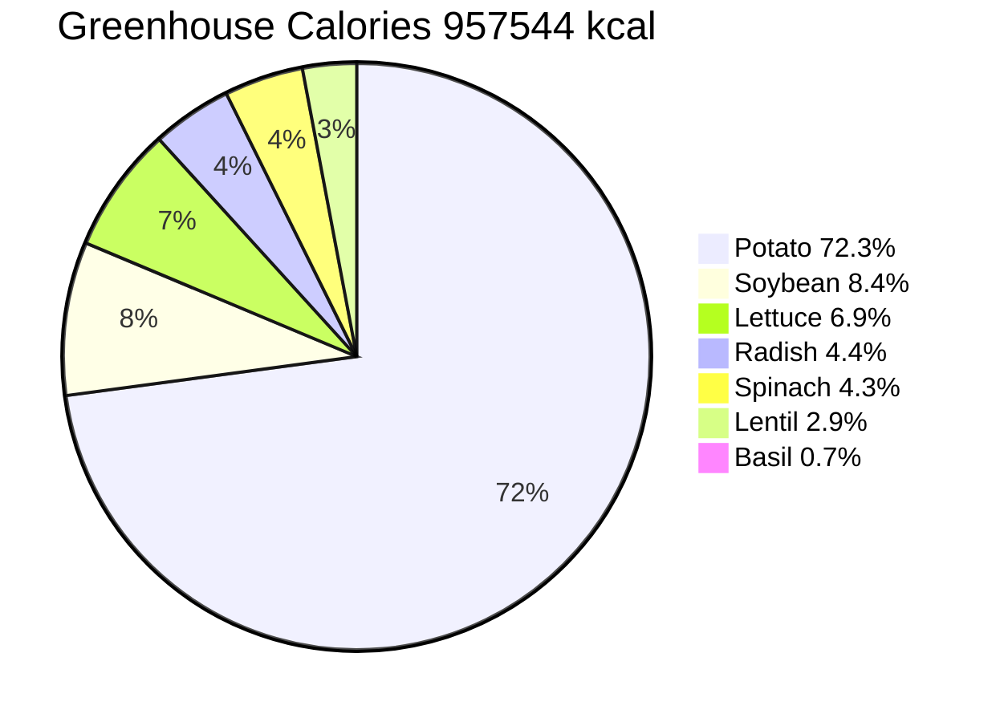
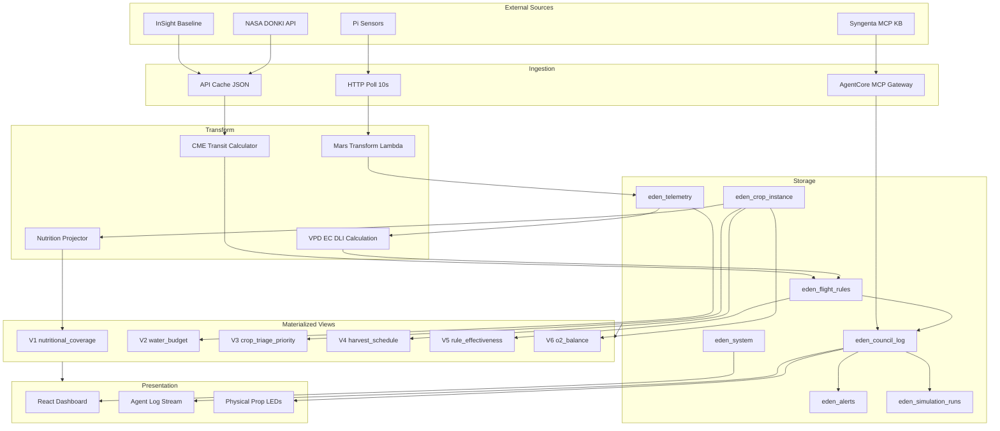
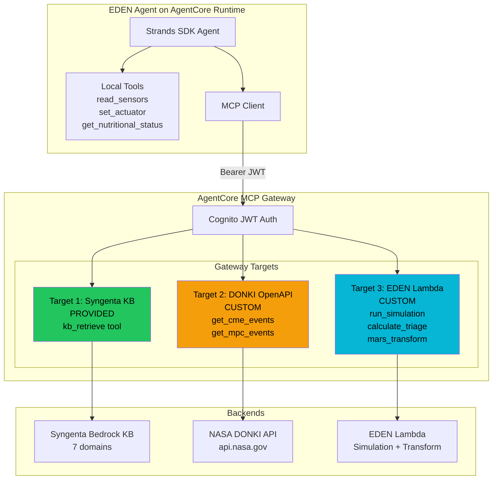

# EDEN Data Model

> Database schema, class diagrams, data flows, views, and MCP gateway architecture.

---

## Master Class Diagram

```mermaid
classDiagram
    direction TB

    class Mission {
        +int crew_size = 4
        +int duration_sols = 450
        +int dome_area_m2 = 100
        +int cargo_kg = 2400
        +float calorie_baseline_kcal = 3000
        +int total_person_days = 1800
    }

    class Zone {
        +string id
        +string label
        +string color
        +int area_m2
        +string kb_target_pct
        +string[] crop_names
    }

    class CropProfile {
        +string name
        +string zone
        +int growth_days
        +float yield_kg_per_m2_cycle
        +float water_l_per_m2_day
        +int light_hours
        +int light_ppfd_umol
        +float[2] optimal_temp_c
        +float[2] optimal_humidity_pct
        +float[2] ec_range_ms_cm
        +float[2] ph_range
        +int co2_ppm_optimal
        +string radiation_tolerance
    }

    class NutritionFacts {
        +float calories_kcal
        +float protein_g
        +float fat_g
        +float carbs_g
        +float fiber_g
        +float vitamin_c_mg
        +float iron_mg
        +float calcium_mg
        +float vitamin_k_ug
        +float folate_ug
        +float potassium_mg
        +float zinc_mg
    }

    class BBCHStage {
        +string code
        +string name
        +string description
        +int[2] day_range
    }

    class StressProfile {
        +string[] vulnerable_bbch
        +string vulnerability_desc
        +int radiation_yield_loss_pct
        +int drought_tolerance_days
        +float cold_threshold_c
        +float heat_threshold_c
        +string[] deficiency_signs
    }

    class CompanionLink {
        +string partner_crop
        +string benefit
        +string mechanism
    }

    class CEAParams {
        +int[2] germ_temp_c
        +int germ_days
        +int germ_rate_pct
        +float[2] root_zone_temp_c
        +float dli_optimal
        +int photoperiod_h
        +float[3] transpiration_rates
        +string[] space_cultivars
    }

    class CropInstance {
        +string crop_name
        +string zone_id
        +float area_m2
        +int current_cycle
        +string bbch_stage
        +int days_planted
        +int days_to_harvest
        +int health_pct
        +string status
        +float water_need_l_day
        +string companion_crop
    }

    class GrowthCycle {
        +string crop_name
        +int cycle_num
        +int plant_sol
        +int harvest_sol
        +float predicted_yield_kg
        +float actual_yield_kg
        +float yield_deviation_pct
        +string[] stress_events
        +string[] rules_triggered
    }

    class ZoneSensorReading {
        +string zone_id
        +long timestamp
        +int sol
        +float temp_c
        +float humidity_pct
        +float soil_moisture_pct
        +int co2_ppm
        +float light_pct
        +float ph
        +float ec_ms_cm
        +float vpd_kpa
        +float dli_mol
    }

    class SystemReading {
        +long timestamp
        +int sol
        +float water_reserve_l
        +float battery_pct
        +float solar_output_pct
        +float desal_rate_l_sol
        +float dome_pressure_hpa
        +float outside_temp_c
        +float radiation_usv_hr
        +float o2_contribution_pct
        +string dashboard_state
    }

    class CrewMember {
        +string id
        +string name
        +string role
        +float calorie_modifier
        +int daily_calories_adjusted
        +string preference
        +string[] dietary_flags
    }

    class DailyRequirement {
        +int calories_kcal = 3000
        +int protein_g = 60
        +int fat_g = 70
        +int carbs_g = 350
        +int fiber_g = 25
        +int vitamin_c_mg = 90
        +int iron_mg = 8
        +int calcium_mg = 1000
        +int vitamin_d_ug = 15
        +int vitamin_k_ug = 120
        +int folate_ug = 400
        +int potassium_mg = 3500
        +int zinc_mg = 11
    }

    class FlightRule {
        +string id
        +string category
        +string trigger
        +string action
        +string priority
        +string source
        +int created_sol
        +int trigger_count
        +bool active
    }

    class CouncilLogEntry {
        +long timestamp
        +int sol
        +string agent
        +string msg
        +string type
        +int severity
    }

    class TriageRecord {
        +string crop
        +string zone
        +float salvageability
        +string color
        +string crew_impact
        +string mitigation
        +map nutritional_delta
    }

    class KBQueryLog {
        +string query
        +string source_doc
        +string response_summary
    }

    class VoteRecord {
        +string decision
        +map agent_votes
        +string reasoning
    }

    class FlightRuleProposal {
        +string proposed_id
        +string trigger
        +string action
        +string evidence
    }

    class CMEEvent {
        +string activity_id
        +string start_time
        +string source_location
        +float speed_km_s
        +float half_angle_deg
        +string[] instruments
        +float mars_eta_hours
        +string risk_level
    }

    class SimulationRun {
        +string run_id
        +string triggered_by
        +int sol
        +string scenario
        +string selected_strategy
        +float actual_loss_pct
        +float model_accuracy_pct
    }

    class Strategy {
        +string name
        +float predicted_loss_pct
        +int recovery_sols
        +string resource_cost
        +float confidence_pct
        +bool selected
    }

    class Alert {
        +string alert_id
        +int sol
        +string severity
        +string source
        +string message
        +string zone_id
        +string status
        +string acknowledged_by
    }

    class ActuatorCommand {
        +string zone_id
        +long timestamp
        +string device
        +string action
        +float value
        +string decided_by
        +bool executed
    }

    class MarsCalendarEntry {
        +int sol
        +float ls_deg
        +string season
        +string dust_risk
        +float solar_factor
    }

    class DemoPhase {
        +string id
        +string name
        +string demo_time_range
        +string dashboard_state
        +string bg_tint
        +string led_color
        +int led_brightness
    }

    class MCPGatewayTarget {
        +string name
        +string type
        +string[] tools
        +string endpoint_or_arn
    }

    Mission "1" --> "5" Zone : contains
    Mission "1" --> "4" CrewMember : crew
    Mission "1" --> "1" MarsCalendarEntry : calendar

    Zone "1" --> "*" CropInstance : grows
    Zone "1" --> "*" ZoneSensorReading : produces
    Zone "1" --> "*" ActuatorCommand : receives

    CropInstance "1" --> "1" CropProfile : defined_by
    CropInstance "1" --> "*" GrowthCycle : tracks
    CropInstance "1" --> "0..1" CropInstance : companion_of

    CropProfile "1" --> "1" NutritionFacts : nutrition
    CropProfile "1" --> "*" BBCHStage : stages
    CropProfile "1" --> "1" StressProfile : stress
    CropProfile "1" --> "0..1" CompanionLink : companion
    CropProfile "1" --> "1" CEAParams : growing_reqs

    CrewMember "1" --> "1" DailyRequirement : needs

    CouncilLogEntry "*" --> "1" FlightRule : triggered_by
    CouncilLogEntry "1" --> "0..1" TriageRecord : triage
    CouncilLogEntry "1" --> "0..1" KBQueryLog : kb_query
    CouncilLogEntry "1" --> "0..1" VoteRecord : vote
    CouncilLogEntry "1" --> "0..1" FlightRuleProposal : proposes

    CMEEvent "1" --> "*" CouncilLogEntry : triggers
    CMEEvent "1" --> "0..1" SimulationRun : starts
    SimulationRun "1" --> "*" Strategy : evaluates

    Alert "*" --> "0..1" CrewMember : acknowledged_by

    MCPGatewayTarget "1" --> "*" KBQueryLog : serves
```



---

## Data Flow: Sensors to Decisions to Dashboard



---

## 4-Layer Decision Architecture



---

## Resource Chain



---

## Companion Planting Network



---

## Dashboard State Machine



---

## Harvest Timeline

```mermaid
gantt
    title EDEN Harvest Timeline 450 sols
    dateFormat X
    axisFormat Sol %s

    section Radish 25d
    Cycle 1  :done, r1, 0, 25
    Cycle 2  :done, r2, 30, 55
    Cycle 5  :r5, 120, 145
    Cycle 10 :r10, 270, 295
    Cycle 15 :r15, 420, 445

    section Lettuce 35d
    Cycle 1  :done, l1, 0, 35
    Cycle 4  :l4, 120, 155
    Cycle 11 :l11, 400, 435

    section Spinach 45d
    Cycle 1  :done, s1, 0, 45
    Cycle 5  :s5, 200, 245
    Cycle 9  :s9, 400, 445

    section Potato 90d
    Cycle 1  :crit, p1, 0, 90
    Cycle 2  :crit, p2, 95, 185
    Cycle 3  :crit, p3, 190, 280
    Cycle 4  :crit, p4, 285, 375

    section Soybean 90d
    Cycle 1  :sb1, 0, 90
    Cycle 2  :sb2, 95, 185
    Cycle 4  :sb4, 285, 375

    section Lentil 95d
    Cycle 1  :le1, 0, 95
    Cycle 4  :le4, 300, 395
```



---

## Calorie Sources



---

## Data Lineage End-to-End



---

## AgentCore MCP Gateway Architecture



### Gateway Targets Summary

| # | Target | Type | Auth | Tools Exposed | Status |
|---|--------|------|------|---------------|--------|
| 1 | Syngenta KB | Provided Bedrock KB | Gateway IAM | `kb_retrieve(query, max_results)` | PROVIDED |
| 2 | DONKI CME | OpenAPI on S3 | API Key (NASA) | `get_cme_events(startDate, endDate)`, `get_mpc_events(startDate, endDate)` | SPEC READY |
| 3 | EDEN Lambda | Lambda ARN | Gateway IAM | `run_simulation(scenario, strategies)`, `calculate_triage(resources, crops)`, `mars_transform(earth_readings)` | SPEC READY |

Specs in `agent/mcp-targets/`.

---

## Table Definitions

### T1: `eden_telemetry` -- Zone sensor time-series

PK=`zone_id` SK=`timestamp` | GSI: PK=`sol` SK=`timestamp`

| Column | Type | Nullable | Constraints | Description |
|--------|------|----------|-------------|-------------|
| `zone_id` | S | NO | ENUM(caloric, protein, leafy_green, quick_harvest, support) | Partition key |
| `timestamp` | N | NO | Unix ms | Sort key |
| `sol` | N | NO | 1-450 | Mission sol (GSI PK) |
| `sol_fraction` | N | NO | 0.0-1.0 | Time within sol |
| `temp_c` | N | NO | -10 to 45 | Mars-adjusted |
| `humidity_pct` | N | NO | 0-100 | |
| `soil_moisture_pct` | N | NO | 0-100 | |
| `co2_ppm` | N | NO | 200-5000 | |
| `light_pct` | N | NO | 0-100 | |
| `ph` | N | NO | 4.0-8.0 | |
| `ec_ms_cm` | N | NO | 0.0-5.0 | |
| `vpd_kpa` | N | COMPUTED | | `610.7 * 10^(7.5*T/(237.3+T)) * (1-H/100) / 1000` |
| `dli_mol` | N | COMPUTED | | `ppfd * hours * 3600 / 1e6` |

Volume: ~120M rows over 450 sols

---

### T2: `eden_system` -- Global system state

PK=`"system"` SK=`timestamp`

| Column | Type | Constraints | Description |
|--------|------|-------------|-------------|
| `water_reserve_l` | N | 0-600 | Tank level |
| `battery_pct` | N | 0-100 | |
| `solar_output_pct` | N | 0-100 | 30% during storm |
| `desal_rate_l_sol` | N | 0-120 | |
| `dome_pressure_hpa` | N | 300-700 | Target 500 |
| `outside_temp_c` | N | -120 to 20 | |
| `radiation_usv_hr` | N | 0-1000 | 0.67 nominal, 263 CME |
| `o2_contribution_pct` | N | COMPUTED | from V6 |
| `dashboard_state` | S | ENUM(nominal, alert, crisis, recovery) | |

---

### T3: `eden_crop_instance` -- Active crop state (mutable)

PK=`crop_name` SK=`zone_id`

| Column | Type | Description |
|--------|------|-------------|
| `crop_name` | S | FK -> crop_profile |
| `zone_id` | S | FK -> zone |
| `area_m2` | N | Allocated area |
| `current_cycle` | N | 1-15 |
| `bbch_stage` | S | Current BBCH code |
| `bbch_description` | S | Human-readable |
| `days_planted` | N | Since planting |
| `days_to_harvest` | N | COMPUTED: growth_days - days_planted |
| `health_pct` | N | 0-100 |
| `status` | S | nominal/watch/stressed/critical/dead/harvested |
| `water_need_l_day` | N | COMPUTED: area * profile.water_per_m2 |
| `companion_crop` | S | FK nullable |

---

### T4: `eden_crop_profile` -- Static reference (immutable)

PK=`name` | Source: `data/nutrition/crop-profiles.json`

8 crops: Potato, Soybean, Lentil, Lettuce, Spinach, Radish, Basil, Microgreens.
Full schema in class diagram above. 50+ fields per crop covering nutrition, BBCH stages, stress thresholds, CEA params, companion links.

---

### T5: `eden_growth_cycle` -- Cycle history (learning data)

PK=`crop_name` SK=`cycle_num`

| Column | Type | Nullable | Description |
|--------|------|----------|-------------|
| `crop_name` | S | NO | |
| `cycle_num` | N | NO | 1-15 |
| `zone_id` | S | NO | |
| `plant_sol` | N | NO | |
| `harvest_sol` | N | YES | null if in-progress |
| `predicted_yield_kg` | N | NO | area * yield_per_m2 |
| `actual_yield_kg` | N | YES | Measured at harvest |
| `yield_deviation_pct` | N | COMPUTED | `(actual-predicted)/predicted*100` |
| `stress_events` | L | YES | `[{sol, type, severity, duration_h}]` |
| `flight_rules_triggered` | SS | YES | Rule IDs that fired |

---

### T6: `eden_council_log` -- Agent decisions

PK=`sol` SK=`timestamp` | GSI: PK=`agent` SK=`timestamp`

| Column | Type | Nullable | Description |
|--------|------|----------|-------------|
| `timestamp` | N | NO | Unix ms |
| `sol` | N | NO | |
| `agent` | S | NO | SENTINEL/ORACLE/AQUA/FLORA/VITA/COUNCIL/FLIGHT_CTRL/SYSTEM |
| `msg` | S | NO | Farmer-voice, max 2000 |
| `type` | S | NO | info/warning/alert/critical/decision/triage/action/kb_query |
| `severity` | N | NO | 0-4 |
| `triage_crop` | S | YES | |
| `triage_zone` | S | YES | |
| `triage_salvageability` | N | YES | 0.0-1.0 |
| `triage_color` | S | YES | RED/YELLOW/GREEN/BLACK |
| `triage_crew_impact` | S | YES | Human cost statement |
| `triage_nutritional_delta` | M | YES | {nutrient: pct_change} |
| `kb_query` | S | YES | Question to Syngenta KB |
| `kb_source` | S | YES | Which KB doc responded |
| `kb_response` | S | YES | Key finding |
| `vote_decision` | S | YES | What was voted on |
| `vote_results` | M | YES | {agent: for/against/abstain} |
| `proposed_rule_id` | S | YES | |
| `proposed_rule_trigger` | S | YES | |
| `proposed_rule_action` | S | YES | |

Volume: ~15-30K rows over mission

---

### T7: `eden_flight_rules` -- Deterministic rule engine

PK=`id` | GSI: PK=`category` SK=`priority`

| Column | Type | Description |
|--------|------|-------------|
| `id` | S | FR-T-003, FR-CME-001, etc |
| `category` | S | 11 categories (Temperature, Water, Pressure, Radiation, Light, Nutrients, CO2, Humidity, Energy, Safety, Solar_Events) |
| `trigger` | S | Boolean condition |
| `action` | S | Deterministic response |
| `priority` | S | CRITICAL/HIGH/MEDIUM/LOW |
| `source` | S | Earth baseline / Syngenta KB / CEA / Learned |
| `created_sol` | N | When added |
| `trigger_count` | N | Times fired |
| `last_triggered_sol` | N | Most recent fire |
| `proposed_by` | S | ORACLE if learned |
| `active` | BOOL | Can be disabled |

Growth: 50 at Sol 1 -> ~300 by Sol 450

---

### T8: `eden_crew` -- Crew profiles

PK=`id` | 4 records

| Column | Type | Description |
|--------|------|-------------|
| `id` | S | chen/okonkwo/volkov/reyes |
| `name` | S | Display name |
| `role` | S | Commander/Science Lead/Engineer/Botanist |
| `calorie_modifier` | N | 0.90-1.10 |
| `daily_calories_adjusted` | N | Modified target |
| `preference` | S | Preferred food |
| `dietary_flags` | SS | e.g. {vegetarian} |

---

### T9: `eden_cme_events` -- Solar event tracking

PK=`activity_id`

| Column | Type | Description |
|--------|------|-------------|
| `activity_id` | S | NASA DONKI ID |
| `start_time` | S | ISO 8601 |
| `source_location` | S | Solar coords |
| `speed_km_s` | N | CME speed |
| `half_angle_deg` | N | Angular width |
| `instruments` | SS | Detecting instruments |
| `mars_eta_hours` | N | COMPUTED: 227e6 / speed / 3600 |
| `risk_level` | S | COMPUTED: LOW/MEDIUM/HIGH |
| `affected_crops` | L | COMPUTED: crops in vulnerable BBCH at ETA |

---

### T10: `eden_alerts` -- Alert lifecycle

PK=`alert_id` SK=`timestamp`

| Column | Type | Nullable | Description |
|--------|------|----------|-------------|
| `alert_id` | S | NO | UUID |
| `timestamp` | N | NO | Created at |
| `sol` | N | NO | |
| `severity` | S | NO | info/warning/critical/emergency |
| `source` | S | NO | flight_rule/agent/sensor |
| `source_id` | S | YES | Rule ID or agent name |
| `message` | S | NO | |
| `zone_id` | S | YES | |
| `crop_name` | S | YES | |
| `status` | S | NO | active/acknowledged/resolved/expired |
| `acknowledged_by` | S | YES | crew member id |
| `acknowledged_at` | N | YES | |
| `resolved_at` | N | YES | |

---

### T11: `eden_actuator_commands` -- Device commands

PK=`zone_id` SK=`timestamp`

| Column | Type | Nullable | Description |
|--------|------|----------|-------------|
| `zone_id` | S | NO | Target zone or "system" |
| `timestamp` | N | NO | |
| `device` | S | NO | ENUM(pump, light, fan, shield, heater, desal) |
| `action` | S | NO | ENUM(on, off, set) |
| `value` | N | YES | 0-100 for set commands |
| `decided_by` | S | NO | Agent name or rule ID |
| `executed` | BOOL | NO | Pi confirmed |

---

### T12: `eden_simulation_runs` -- Virtual Farming Lab

PK=`run_id`

| Column | Type | Nullable | Description |
|--------|------|----------|-------------|
| `run_id` | S | NO | UUID |
| `triggered_by` | S | NO | CME event ID or "scheduled" |
| `sol` | N | NO | |
| `scenario` | S | NO | Threat description |
| `strategies` | L | NO | List of Strategy objects |
| `selected_strategy` | S | NO | Name of chosen |
| `council_vote` | M | YES | {agent: for/against} |
| `actual_loss_pct` | N | YES | Post-event measured |
| `model_accuracy_pct` | N | COMPUTED | `100 - abs(predicted - actual)` |

**Strategy object:** `{name, predicted_loss_pct, recovery_sols, resource_cost, confidence_pct, selected}`

---

### T13: `eden_mars_calendar` -- Seasonal reference (static)

PK=`sol` | 45 entries, 10-sol intervals | Source: `data/mars-ls-calendar.json`

| Column | Type | Description |
|--------|------|-------------|
| `sol` | N | 1-450 |
| `ls_deg` | N | Solar longitude |
| `season` | S | N Summer/Autumn/Winter/Spring |
| `dust_risk` | S | low/moderate/high/extreme |
| `solar_factor` | N | 0.857-1.19 |

---

## Materialized Views

### V1: `view_nutritional_coverage`

```
FOR EACH nutrient IN [calories, protein, fat, carbs, fiber, vitamin_c, iron, calcium, vitamin_k, folate, potassium, zinc]:
  required  = daily_per_astronaut[nutrient] * 4 * 450
  produced  = SUM(crop.total_yield_kg * nutrition_per_100g[nutrient] * 10)
  coverage  = produced / required * 100
  severity  = CASE WHEN 0 THEN critical_zero WHEN <10 THEN critical
                   WHEN <50 THEN high WHEN <80 THEN moderate
                   WHEN <120 THEN adequate ELSE surplus END

All 14 nutrients now computed in mission-projection.json.
```

| Nutrient | Required | Produced | Coverage | Severity |
|----------|----------|----------|----------|----------|
| vitamin_k | 216,000 ug | 1,574,675 | 729.0% | surplus |
| vitamin_c | 162,000 mg | 313,834 | 193.7% | surplus |
| iron | 14,400 mg | 21,156 | 146.9% | surplus |
| folate | 720,000 ug | 1,005,429 | 139.6% | surplus |
| fiber | 45,000 g | 36,671 | 81.5% | adequate |
| protein | 108,000 g | 40,774 | 37.8% | moderate |
| calcium | 1,800,000 mg | 615,541 | 34.2% | moderate |
| carbs | 630,000 g | 196,687 | 31.2% | moderate |
| calories | 5,400,000 kcal | 957,544 | 17.7% | high |
| fat | 126,000 g | 6,606 | 5.2% | critical |
| vitamin_d | 27,000 ug | 0 | 0.0% | critical_zero |
| vitamin_b12 | 4,320 ug | 0 | 0.0% | critical_zero |
| potassium | 6,300,000 mg | 6,743,445 | 107.0% | surplus |
| zinc | 19,800 mg | 6,764 | 34.2% | moderate |

---

### V2: `view_water_budget`

```
gross_demand    = SUM(crop.area_m2 * crop.water_l_per_m2_day)
recycled        = gross_demand * 0.65
net_consumption = gross_demand - recycled
surplus_deficit = desal_rate - net_consumption
days_reserve    = water_reserve_l / net_consumption
```

| Metric | Nominal | Storm 30% solar |
|--------|---------|-----------------|
| Gross demand | 262.5 L/sol | 262.5 L/sol |
| Recycled 65% | 170.6 L/sol | 170.6 L/sol |
| Net consumption | 91.9 L/sol | 91.9 L/sol |
| Desal capacity | 120 L/sol | 36 L/sol |
| Surplus/deficit | +28.1 L/sol | -55.9 L/sol |
| Reserve autonomy | 6.5 sols | 2.8 sols |

Water by crop:

| Crop | L/day | % |
|------|-------|---|
| Potato | 157.5 | 60.0 |
| Soybean | 31.5 | 12.0 |
| Lettuce | 25.0 | 9.5 |
| Lentil | 18.0 | 6.9 |
| Spinach | 16.0 | 6.1 |
| Radish | 10.5 | 4.0 |
| Basil | 3.0 | 1.1 |
| Microgreens | 1.0 | 0.4 |

---

### V3: `view_crop_triage_priority`

```
FOR EACH crop_instance:
  calorie_value    = remaining_yield * cal_per_kg           * 0.30
  water_efficiency = cal_per_kg / water_per_m2              * 0.20
  investment_ratio = days_planted / growth_days              * 0.20
  drought_buffer   = normalize(drought_tolerance_days)       * 0.15
  health           = health_pct / 100                        * 0.15
  triage_score     = SUM(above)
  color = RED if score>0.7 AND urgent, YELLOW if >0.5, GREEN if >0.3, BLACK else
```

---

### V4: `view_harvest_schedule`

```
FOR EACH crop, cycle IN 1..max_cycles:
  plant_sol   = (cycle-1) * (growth_days + 5)
  harvest_sol = plant_sol + growth_days
  yield_kg    = area_m2 * yield_per_m2
  IF harvest_sol <= 450: EMIT row
```

| Crop | Cycles | First Harvest | Last Harvest | Total kg |
|------|--------|---------------|--------------|----------|
| Radish | 15 | Sol 25 | Sol 445 | 262.5 |
| Basil | 12 | Sol 30 | Sol 415 | 28.8 |
| Lettuce | 11 | Sol 35 | Sol 435 | 440.0 |
| Spinach | 9 | Sol 45 | Sol 445 | 180.0 |
| Potato | 4 | Sol 90 | Sol 375 | 900.0 |
| Soybean | 4 | Sol 90 | Sol 375 | 18.0 |
| Lentil | 4 | Sol 95 | Sol 395 | 8.0 |

---

### V5: `view_rule_effectiveness`

```
FOR EACH flight_rule WHERE trigger_count > 0:
  fires       = trigger_count
  outcomes    = JOIN growth_cycle.stress_events WHERE rule fired
  yield_saved = SUM(predicted_loss - actual_loss)
  precision   = fires_with_real_threat / total_fires
```

---

### V6: `view_o2_balance`

```
FOR EACH zone:
  active_leaf_m2    = crop.area_m2 * (health_pct/100) * leaf_area_index
  photosynthesis    = active_leaf_m2 * light_pct/100 * co2_factor
  o2_ml_hr          = photosynthesis * 6   -- stoichiometric

total_o2            = SUM(zones)
crew_consumption    = 4 * 840 L/day
greenhouse_o2_pct   = total_o2 / crew_consumption * 100

Nominal: ~14.2%  |  Storm 30% light: ~8-10%  |  Crop loss: proportional drop
```

---

## Active Crop Inventory

| Crop | Zone | Area m2 | Growth Days | Cycles | Total Yield kg | Rad Tolerance |
|------|------|---------|-------------|--------|----------------|---------------|
| Potato | caloric | 45 | 90 | 4 | 900.0 | high |
| Soybean | protein | 15 | 90 | 4 | 18.0 | moderate |
| Lentil | protein | 10 | 95 | 4 | 8.0 | low |
| Lettuce | leafy_green | 10 | 35 | 11 | 440.0 | low |
| Spinach | leafy_green | 8 | 45 | 9 | 180.0 | low |
| Radish | quick_harvest | 7 | 25 | 15 | 262.5 | moderate |
| Basil | support | 3 | 30 | 12 | 28.8 | low |
| Microgreens | support | 2 | 12 | ~37 | bridge | -- |
| **TOTAL** | | **100** | | | **1,837.3** | |

---

## Gap Analysis

### Critical (blocks demo)

| # | Gap | Status |
|---|-----|--------|
| G1 | mock.js uses v1 crop mix (Wheat, Tomato) | Bryan updating |
| G2 | sensor-baseline.json uses v1 zone names | Bryan updating |
| G3 | No WebSocket schema for live updates | OPEN -- define `{type, payload, ts}` |

### High (RESOLVED)

| # | Gap | Resolution |
|---|-----|------------|
| G4 | No simulation result schema | DONE -- T12 `eden_simulation_runs` defined |
| G5 | No growth cycle history | DONE -- T5 `eden_growth_cycle` defined |
| G6 | No alert lifecycle | DONE -- T10 `eden_alerts` defined |
| G7 | No actuator command schema | DONE -- T11 `eden_actuator_commands` defined |
| G8 | Only 1/3 MCP gateway targets implemented | DONE -- OpenAPI + Lambda specs in `agent/mcp-targets/` |
| G9 | Potassium + zinc not in projection | DONE -- potassium 107.0% surplus, zinc 34.2% moderate gap |
| G10 | CEA data missing for Lettuce, Radish, Basil | DONE -- added to `crop-cea-data.json` with space cultivars + NASA refs |
| G11 | USDA cross-ref missing for Lettuce, Radish, Basil | DONE -- added FDC 169247, 169276, 172232, all verified |
| G12 | mission-plan-450.json still v1 | DONE -- rewritten v2 with correct zones, crops, milestones |

### Medium (Q&A depth)

| # | Gap | Notes |
|---|-----|-------|
| G13 | Vitamin A not tracked (spinach 469ug) | Add to crop profile |
| G14 | O2 model static | V6 defined, needs implementation |
| G15 | Lentil USDA discrepancy (calcium 56 vs 35mg) | Pick variety, standardize |
| G16 | Agent Python code does not exist | `agent/` has no `.py` files -- Bryan building |
| G17 | Lambda handler for Eden tools not implemented | Spec ready, code needed |

---

## File Inventory

| File | Maps To | Version | Status |
|------|---------|---------|--------|
| `data/nutrition/crop-profiles.json` | T4 | v2.0 | Current |
| `data/nutrition/crew-requirements.json` | T8 | v2.0 | Current |
| `data/nutrition/mission-projection.json` | V1 V2 V4 | v2.0 | Current |
| `data/nutrition/triage-scenarios.json` | V3 | v2.0 | Current |
| `data/nutrition/crop-cea-data.json` | T4 CEA | v2.0 | Current (9 crops incl lettuce/radish/basil) |
| `data/nutrition/usda-crossref.json` | T4 validation | v2.0 | Current (9 crops, all v2 verified) |
| `data/telemetry/sensor-baseline.json` | T1+T2 | v1 zones | **STALE -- Bryan updating** |
| `data/telemetry/timeseries-cme-crisis.json` | T1+T2 | -- | Current |
| `data/telemetry/crop-states.json` | T3 | v2.0 | Current |
| `data/mars-ls-calendar.json` | T13 | -- | Current |
| `data/agent-log-schema.json` | T6 schema | -- | Current |
| `data/dashboard-config.json` | State machine | -- | Current |
| `data/demo-scenario/demo-script.json` | Demo | -- | Current |
| `data/demo-scenario/demo-cme-event.json` | T9 | -- | Current |
| `data/demo-scenario/mission-plan-450.json` | T3+V4 | v2-kb-aligned | Current (5 zones, 8 crops, stagger) |
| `agent/flight-rules.json` | T7 | v1.0 | Current |
| `agent/mcp-targets/donki-cme-openapi.json` | T9 MCP | v1.0 | Current |
| `agent/mcp-targets/eden-lambda-tools.json` | T12 MCP | v1.0 | Current |
| `agent/mcp-targets/README.md` | Deployment guide | v1.0 | Current |
| `eden-dashboard/src/data/mock.js` | Dashboard | v1 | **Bryan updating** |
